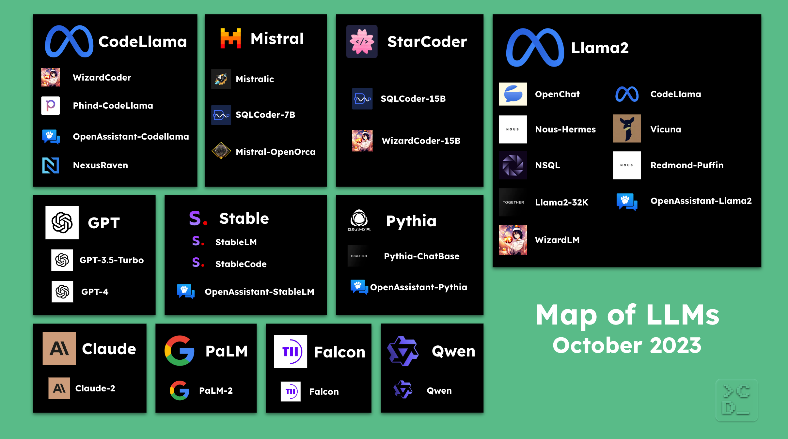

# What LLM to use? A perspective from the Dev+AI space

With how fast things are moving in the Dev+AI space, a shorthand for the community of developers building software with the help of large language models (LLMs), it can be challenging to figure out which model to use.

We started this repository based on our experiences as part of the [Continue community](https://github.com/continuedev/continue). Feel free to suggest improvements and help us keep it up-to-date by opening a pull request!

This post was also published on the [Continue Blog]().

## What LLMs are there?

There are A LOT of LLMs. We’ve decided to focus on the ones that we see folks using now:

You can find a CSV that includes all of these models and information about them [here](./LLMs.csv).

## What LLMs are being used while coding?

### How do folks decide?

The first choice you typically make is whether you are going to use an **open-source model** or a **commercial model**:

- You usually select an **open-source LLM** when you want to keep your code within your environment, have enough available memory, want to keep your costs low, want to be able to manage and optimize everything end-to-end, etc.
- You usually select a **commercial LLM** when you want the best model, prefer an easy and reliable setup, don’t have a lot of available memory, don’t mind your code leaving your environment, are not deterred by cost concerns, etc.

If you decide to use an **open-source LLM**, your next decision is whether to set up the model on your local machine or on a hosted model provider:

- You usually opt to use an open-source model on your *local machine* when you have enough available memory, want free usage, want to be able to use the model without needing an Internet connection, etc.
- You usually opt to use an open-source model on a *hosted provider* when you want the best open-source model, don’t have a lot of available memory on your local machine, want the model to serve multiple people, etc.

If you decide to use a **commercial model**, they you get your API keys and try playing with each of them. You typically compare them based on the quality of the suggestions and the cost to use. 

### Open Source

*From most popular to least popular:*

#### 1. Code Llama

    
Details

    Creator: Meta
    
    Overview: Code Llama is built on top of Llama 2, fine-tuned for generating and discussing code.
    
    Parameters: 7B, 13B, 34B 
    
    Base: Llama 2
    
    Date released: August 24th, 2023
    
    License: Llama 2 Community
    

#### 2. WizardCoder

    
Details

    
    Creator: WizardLM
    
    Overview: The Evol-Instruct method is adapted for coding tasks to create a training dataset, which is used to fine-tune StarCoder for the 15B model and Code Llama for the 34B model.
    
    Parameters: 15B, 34B
    
    Base: StarCoder (15B) / Code Llama (34B)
    
    Date released: August 26th, 2023
    
    License: OpenRAIL-M (15B) / Llama 2 Community (34B)
    

#### 3. Phind-CodeLlama

    
Details

    
    Creator: Phind
    
    Overview: A proprietary dataset of ~80k high-quality programming problems and solutions was used to fine-tuned Code Llama before being further fine-tuned on 1.5B additional tokens.
    
    Parameters: 34B
    
    Base: Code Llama
    
    Date released: August 28th, 2023
    
    License: Llama 2 Community
    

#### 4. Mistral

    
Details

    
    Creator: Mistral AI
    
    Overview: The creators claim that it “approaches CodeLlama 7B performance on code, while remaining good at English tasks”.
    
    Parameters: 7B
    
    Base: Mistral
    
    Date released: September 27th, 2023
    
    License: Apache 2.0
    

#### 5. StarCoder

    
Details

    
    Creator: BigCode
    
    Overview: The model was trained on trained on 80+ programming languages from The Stack (v1.2), with opt-out requests excluded. As such it is not an instruction model and commands like "Write a function that computes the square root." do not work well. However, by using the [Tech Assistant prompt](https://huggingface.co/datasets/bigcode/ta-prompt) you can make it more helpful.
    
    Parameters: 15B
    
    Base: StarCoder
    
    Date released: May 4th, 2023
    
    License: OpenRAIL-M
    

#### 6. Llama2

    
Details

    
    Creator: Meta
    
    Overview: Good for English conversations but struggles to make code edits
    
    Parameters: 7B, 13B, 70B
    
    Base: Llama 2
    
    Date released: July 18th, 2023
    
    License: Llama 2 Community
    

### Commercial

*From most popular to least popular:*

#### 1. GPT-4

    
Details

    
    Creator: OpenAI
    
    Overview: GPT-4 is generally considered to be the best LLM to use while coding. However, it is quite expensive and requires you to send your code to OpenAI via their API.
    

#### 2. GPT-3.5 Turbo

    
Details

    
    Creator: OpenAI
    
    Overview: GPT-3.5 is cheaper and faster than GPT-4; however, its suggestions are not nearly as good.
    

#### 3. Claude 2

    
Details

    
    Creator: Anthropic
    
    Overview: Claude 2 is not yet publicly released, but you can request early access.

##### 4. PaLM 2

    
Details

    
    Creator: Google

    Overview: The Google PaLM API is currently in public preview; you can try it via Google Makersuite.

